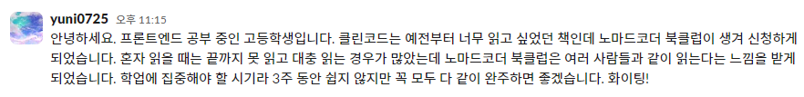

# **2024 01 28 TIL**

#### **DAY 2** &nbsp;

**오늘 읽은 범위 : 2장, 의미 있는 이름**

> ## 책에서 기억하고 싶은 내용을 써보세요!

- _변수 이름은 의도를 분명히 밝혀라_
  &nbsp;

- _검색하기 쉬운 이름을 사용하라_

---

> ## 오늘 읽은 소감은? 떠오르는 생각을 가볍게 적어보세요

- 여기서 보여준 예시 코드나 잘못된 예시들이 실제로 내가 다 한번쯤은 써본 기억이 있어 굉장히 소름 돋았다.
  &nbsp;

- '특히 검색하기 쉬운 이름을 사용하라' 라는 말에서 얼마전에 했던 프론트엔드 프로젝트에서 찾고 싶은 변수를 찾는데 검색을 하지 못한 경험이 생각났다. 다음부터는 변수 이름을 조금 더 직관적이고 명확하게 하여 편리하게 찾고 고쳐야겠다.

---

> ## 이 책을 왜 읽으시나요?

- 여러가지 이유가 있겠지만 클린코드는 예전부터 읽고 싶었던 책이였다. 예전부터 계속 코드를 볼때 내가 무슨 생각으로 저 상황에서 저런 코드를 썼지? 라는 생각을 가지고 코드를 바라보는 시각이 늘었다. 결국 그 코드를 처음부터 끝까지 전부 해석하고 해독하는 과정을 거쳤어야했다. 이런 일들을 앞으로는 방지하고자 본격적으로 프로젝트를 만들기전에 읽어보고자 했다.

---

> ## Slack에 올린 자기소개

&nbsp;

