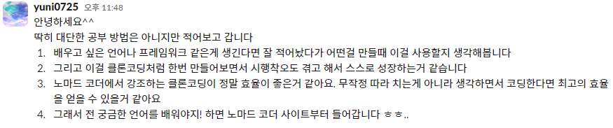

# **2024 02 07 TIL**

#### **DAY 13** &nbsp;

**오늘 읽은 범위 : 7장, 오류처리**

> ## 책에서 기억하고 싶은 내용을 써보세요!

- _Try-Catch-Finally 문부터 작성하라_

- _예외에 의미를 제공하라_

- _null을 반환하지도, 전달하지도 마라_

---

> ## 오늘 읽은 소감은? 떠오르는 생각을 가볍게 적어보세요

- Try-Catch-Finally는 자바스크립트에도 있는 문법인데 현재 진행하고 있는 리액트 프로젝트에 열심히 써봐야겠다
  &nbsp;

- 예외에 의미를 제공하라는 말에서부터 Try-Catch-Finally를 사용할때 주석처리를 해서 한번 써보고 나중에 읽어봐야겠다

> ## 공부법 공유하기

&nbsp;

